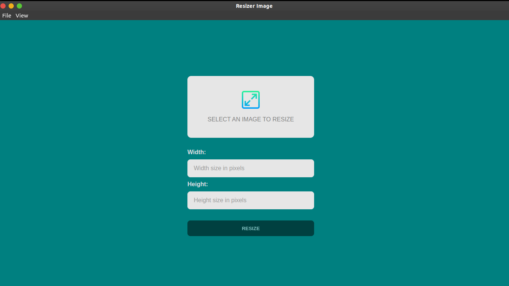

# Electron Resizer Image




<br />
<hr>

## Description

<div>
  <p>
    Electron Resizer Image is a project very simple, you can upload an image and change your size and save. This project is based, at a video on YouTube of channel <a href="https://www.youtube.com/c/TraversyMedia" target="_blank">Traversy Media</a> link to video click <a href="https://www.youtube.com/watch?v=ML743nrkMHw&t=1966s">here</a>.
    
  </p>
</div>

## Techs

<ul>
  <li><a href="https://www.electronjs.org/docs/latest" target="_black">Electron</a></li>
  <li><a href="https://reactjs.org/docs/getting-started.html" target="_black">ReactJS</a></li>
  <li><a href="https://www.typescriptlang.org" target="_black">Typescript</a></li>
  <li><a href="https://styled-components.com/docs" target="_black">Styled Components</a></li>
  <li><a href="https://www.npmjs.com/package/react-image-file-resizer" target="_black">React Image File Resizer</a></li>
</ul>

## How to run 

Just clone this project and run:

```bash
yarn or npm i
```

and execute:
```bash
yarn start or npm run start
```


